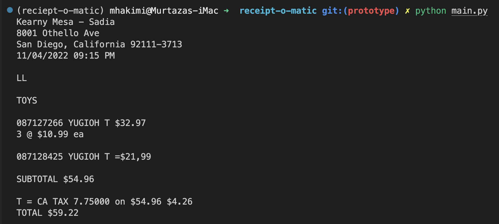

# :mag: **(DEPRECATED)** receipt-o-matic

**(DEPRECATED)** Prototype for automated receipt reader.

The ocr of the receipt would then require further parsing so decided instead to just grab the data I needed from the safeway API ([safeway-scrubber](https://github.com/mhakimi-adi/safeway-scrubber)).

## :hammer: Build

Prequisites: 
- `python` installed
- `conda` installed
- `tesseract` installed --> `brew install tesseract`

```bash
conda create --name my_project_env
conda activate my_project_env
pip install -r requirements.txt
```

## :snake: Python

This program simply uses `pytesseract` to scan an image of a receipt and parse out the text.

```bash
python main.py
```


